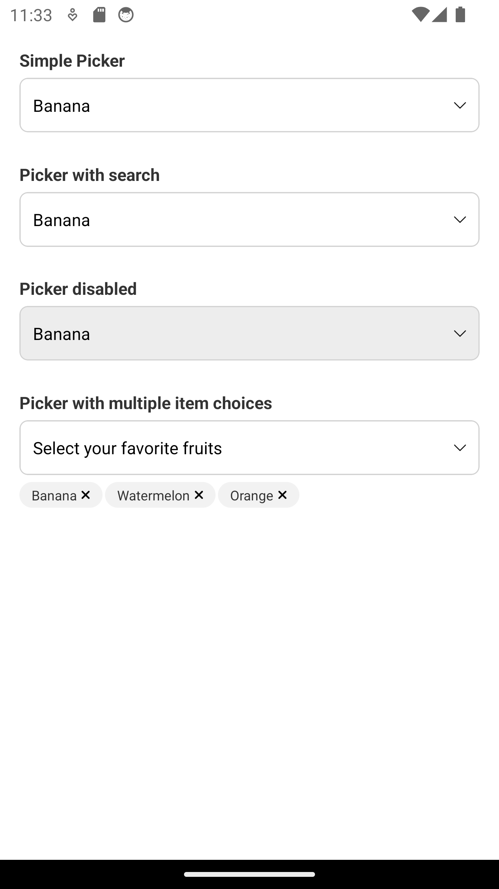
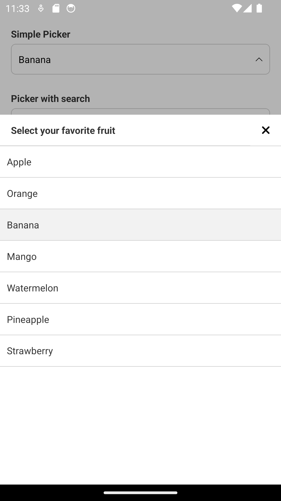
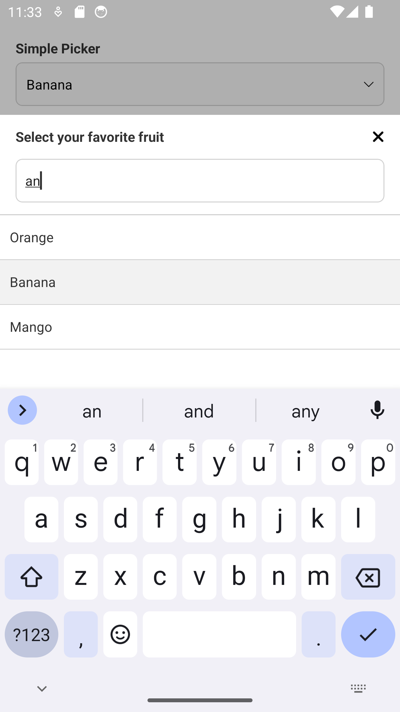
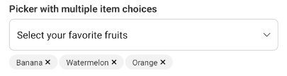

# react-native-bottom-select-picker

React Native Bottom Select Picker is a library that provides a customizable Picker component for React Native applications. <br />
This library simplifies the process of creating picker menus and provides a variety of options to customize the picker

# Getting started

```
npm install react-native-bottom-select-picker
```

or

```
yarn add react-native-bottom-select-picker
```

## Linking

```
cd ios && pod install
```

# Picker Props

| #   | Prop              | Params                                 | isRequired | Description                                                                                |
| --- | ----------------- | -------------------------------------- | ---------- | ------------------------------------------------------------------------------------------ |
| 1   | data              | PickerItem[]                           | true       | { label: string, value: string }                                                           |
| 2   | value             | String                                 | true       | Default value                                                                              |
| 3   | onChange          | (value: string) => void                | true       | Selection callback                                                                         |
| 4   | placeholder       | String                                 | true       | The string that will be rendered before picker has been selected, and show in header title |
| 5   | search            | Boolean                                | no         | Show search input in picker modal                                                          |
| 6   | searchPlaceholder | String                                 | no         | Placeholder in TextInput search                                                            |
| 7   | disable           | Boolean                                | no         | Specifies the disabled state of the Picker                                                 |
| 8   | containerStyle    | ViewStyle                              | no         | Styling for container Picker                                                               |
| 9   | renderArrow       | (pickerShown) => ReactNode             | no         | Custom arrow icon                                                                          |
| 10  | closeIcon         | () => ReactNode                        | no         | Custom close icon modal header                                                             |
| 11  | renderItem        | ({ item, isSelected }) => ReactElement | no         | Custom render item in list modal                                                           |
| 12  | multiple          | boolean                                | no         | Multiple select values                                                                     |

# Picker Example

<div style="display: flex; gap: 5px;">
  
  
  
  
</div>

```jsx

const data: PickerItem[] = [
  {
    label: 'Apple',
    value: 'Apple',
  },
  {
    label: 'Orange',
    value: 'Orange',
  },
  ...
];
```

## Simple Picker


```jsx
import { Picker, type PickerItem } from 'react-native-bottom-select-picker';

const [value, setValue] = useState<string>('');

<View>
  <Text>Simple Picker</Text>
  <Picker
    placeholder={'Select your favorite color'}
    data={data}
    value={value}
    onChange={setValue}
  />
</View>;
```

## Picker with search


```jsx
import { Picker, type PickerItem } from 'react-native-bottom-select-picker';

const [value, setValue] = useState<string>('');

<View>
  <Text>Picker with search</Text>
  <Picker
    placeholder={'Select your favorite fruit'}
    data={data}
    value={value}
    onChange={setValue}
    search
  />
</View>;
```

## Picker disabled


```jsx
import { Picker, type PickerItem } from 'react-native-bottom-select-picker';

const [value, setValue] = useState<string>('');

<View>
  <Text>Picker disabled</Text>
  <Picker
    placeholder={'Select your favorite fruit'}
    data={data}
    value={value}
    onChange={setValue}
    disable
  />
</View>;
```

## Picker with multiple item choices



```jsx
import { Picker, type PickerItem } from 'react-native-bottom-select-picker';

const [multipleValue, setMultipleValue] = useState<string[]>([]);

<View>
  <Text>Picker with multiple item choices</Text>
  <Picker
    placeholder={'Select your favorite fruits'}
    data={data}
    value={multipleValue}
    onChange={setMultipleValue}
    multiple
  />
</View>
```
