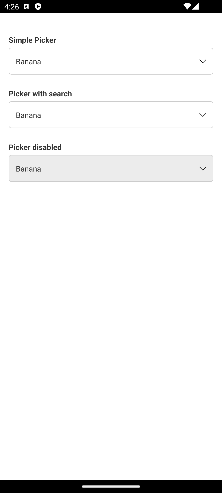
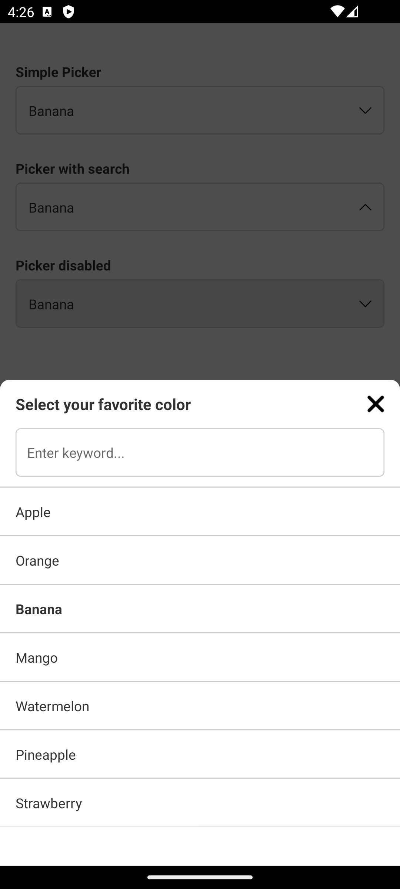

# react-native-bottom-select-picker

React Native Bottom Select Picker is a library that provides a customizable Picker component for React Native applications. <br />
This library simplifies the process of creating picker menus and provides a variety of options to customize the picker

# Getting started

```
npm install react-native-bottom-select-picker
```

or

```
yarn add react-native-bottom-select-picker
```

## Linking

```
cd ios && pod install
```

# Picker Props

|  #  | Prop                    | Params                  | isRequired | Description                                                                                |
|-----|-------------------------|-------------------------|------------|--------------------------------------------------------------------------------------------|
| 1   | data                    | PickerItem[]            | true       | { label: string, value: string }                                                           |
| 2   | value                   | String                  | true       | Default value                                                                              |
| 3   | onChange                | (value: string) => void | true       | Selection callback                                                                         |
| 4   | placeholder             | String                  | true       | The string that will be rendered before picker has been selected, and show in header title |
| 5   | search                  | Boolean                 | no         | Show search input in picker modal                                                          |
| 6   | searchPlaceholder       | String                  | no         | Placeholder in TextInput search                                                            |
| 7   | disable                 | Boolean                 | no         | Specifies the disabled state of the Picker                                                 |
| 8   | containerStyle          | ViewStyle               | no         | Styling for container Picker                                                               |
| 9   | containerDisableStyle   | ViewStyle               | no         | Styling for container Picker when disable is true                                          |
| 10  | textStyle               | TextStyle               | no         | Styling for Picker text                                                                    |
| 11  | placeholderStyle        | TextStyle               | no         | Styling for Picker placeholder text                                                        |
| 12  | inputSearchStyle        | TextStyle               | no         | Styling for Search input                                                                   |

# Picker Example
<div style="display: flex; gap: 5px;">
  
  
  
</div>

```jsx
import * as React from 'react';
import { useState } from 'react';

import { StyleSheet, Text, View } from 'react-native';
import { Picker, type PickerItem } from 'react-native-bottom-select-picker';

const data: PickerItem[] = [
  {
    label: 'Apple',
    value: 'Apple',
  },
  {
    label: 'Orange',
    value: 'Orange',
  },
  {
    label: 'Banana',
    value: 'Banana',
  },
  {
    label: 'Mango',
    value: 'Mango',
  },
  {
    label: 'Watermelon',
    value: 'Watermelon',
  },
  {
    label: 'Pineapple',
    value: 'Pineapple',
  },
  {
    label: 'Strawberry',
    value: 'Strawberry',
  },
];
export default function App() {
  const [value, setValue] = useState<string>('');

  return (
    <View style={styles.container}>
      <View>
        <Text style={styles.label}>Simple Picker</Text>
        <Picker
          placeholder={'Select your favorite color'}
          data={data}
          value={value}
          onChange={setValue}
        />
      </View>

      <View>
        <Text style={styles.label}>Picker with search</Text>
        <Picker
          placeholder={'Select your favorite color'}
          data={data}
          value={value}
          onChange={setValue}
          search
        />
      </View>

      <View>
        <Text style={styles.label}>Picker disabled</Text>
        <Picker
          placeholder={'Select your favorite color'}
          data={data}
          value={value}
          onChange={setValue}
          disable
        />
      </View>
    </View>
  );
}

const styles = StyleSheet.create({
  container: {
    flex: 1,
    paddingHorizontal: 16,
    paddingVertical: 40,
    gap: 25,
  },
  label: {
    marginBottom: 5,
    fontWeight: 'bold',
    color: '#333333',
  }
});
```
